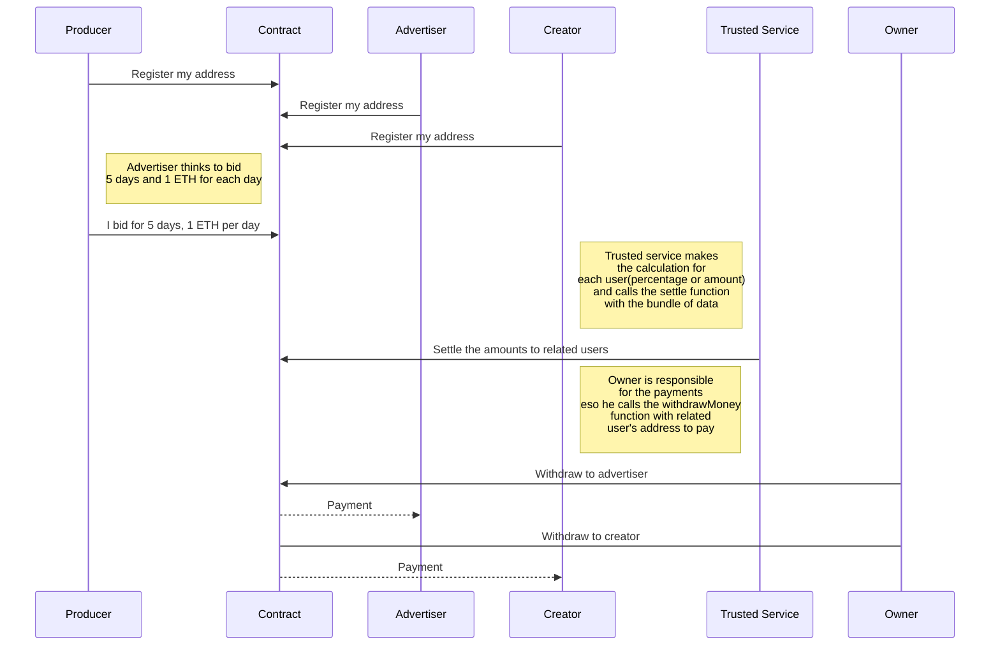

# Advertisement Upgradeable

<!-- ABOUT THE PROJECT -->

## About The Project

This is a sample project of an upgradeable advertisement system.

  *!Please note that it's not safe to use this project in a production environment.!*


The project mainly consists of the advertisement_v1 contracts, the tests, the deployment scripts and configurations.

There are mainly 3 roles: **Owner**, **RegistedUsers** and **TrustedService**.

Registered users are a cluster of users and it branches into different groups such as **Advertiser**, **Creator**, **Publisher**, etc.

### Flows
The contract has 3 start-up variables: the Name, the Owner Address(openzeppelin ownable contracts for details) and the Trusted Service Address. Trusted Service manages the settlement process off-chain and calls the settle function on the contract. This function can be called by only the trusted service. Like the Trusted Service, the Owner is also an actor in the system. Payment-related functions on the contract can be called only by the owner.


![System Overview][system-overview]


To consume the Advertisement contract's features as a user, anyone has to be registered on the system. Registration not only shows the registration info but also creates a pay account assigned to the user. These flows represents in image above with numbers. 

So, firstly the contract lets users register to the system. There are no role-based limitations in the registration process. Note that once a wallet address is registered, it's not possible to register again. **(1)**

Once a user is registered, he/she can bid on the system. The bidding process is sending the count of days, and the amount to be paid per day as parameters and sending eth of the amount of day count*eth per day. **(2)**

For example: if a registered user calls the bid function with the parameters (20, 30), he also should send 600 Wei to the contract. Note that every financial calculation is based on Wei in the contract.

At any time, the trusted service can call the settle function **(3)**. This function distributes the bid amount to the addresses sent by the trusted service. The settle function gets 3 parameters: uint256 bid_id, addresses[] shareholders and uint256[] shares. This function can also gets a tuple array but to keep the contract simple and cost-efficient, I avoid adding another struct to the contract.

The settle function distributes the shares to the addresses. So, the shareholders' and shares’ lists have to be of the same length. 

Distribution in this step means changing the balance of the pay accounts of the registered users. So, users are not paid yet.

After the registration process, the owner executes the payment from the pay accounts. **(4a,4b)**

## Technical Details, Limitations and Future Works


This section contains the technical explanation of the project, limitations and future works to make its product ready.

### UML diagram



### Proxy
The contract was designed and implemented following OpenZeppelin's proxy model. After the deployment, it will be seen that the contract is a proxy on etherscan. So, to use its proper way, it needs to be verified after the deployment. Hardhat verification command can be found later in this document.

Unlike regular contracts, upgradeable contracts have an initializer function instead of a constructor. Our contract is deployed specifically by hardhat's deployProxy method. This method gets the upgradeable contract and initial parameters. In our case, it is the trusted service address to be set at the initializing.

To provide the proxy pattern, we use OpenZeppelin's libraries imported. [Visit for further info](https://docs.openzeppelin.com/upgrades-plugins/1.x/writing-upgradeable)

### Structs
There are 2 [structs](https://docs.soliditylang.org/en/v0.8.14/structure-of-a-contract.html), pay and bid. Pay both keep a wallet address registration info as boolean and pay an amount of the address. With this perspective, the pay struct can be assumed as a pay account. Bid struct, on the other hand, is used for getting the bids from registered users and keeps the address of the bidder and the total amount of the bid.

These 2 structs' instances are stored in [mappings](https://docs.soliditylang.org/en/v0.8.14/style-guide.html?highlight=mapping#mappings). These are payAccounts and bids. PayAccounts maps a wallet address to pay, and bids maps a bid id to bid. Please note that mappings work like key-value hashmaps. This design makes iterations impossible. Also, any query on mappings will always return a value, meaningful or meaningless.

### Variables
Another variable on the contract is totalAmount. This represents the total amount of ethers on the contract. The contract accepts etheres with [payable](https://docs.soliditylang.org/en/v0.8.12/contracts.html#receive-ether-function) functions and distributes it with withdrawMoney function.

### Events
Deployed, Registered, BidDone, Settled, Withdraw [events](https://docs.soliditylang.org/en/v0.8.12/contracts.html#events) return boolean values. Contract integrated outer systems can listen and catch these events to get successful results of related methods.

### Function Modifiers
onlyRegistered and onlyTrustedService [modifiers](https://docs.soliditylang.org/en/v0.8.12/contracts.html#function-modifiers) are responsible to let only authorized users call the functions. The most famous modifier is onlyOwner.

### Limitations
Distributed data storage structure of blockchains makes storage and processing power expensive. This enforces developers to implement contracts predictably for storage and gas efficiency on ethereum.

Loops may be dangerous for smart contracts because of their unpredictable nature. Loop-containing functions must be called carefully in smart contracts. In our contract, the settle function has a for loop. Since this function is modified by the onlyTrustedService modifier, we don't let untrusted parties call it and expect the trusted service not to send a long array.

### Future Works
To keep it simple and limited time to work on it, I kept pay accounts simple. So, the bid amount on the contract is set to work only with a fixed amount, percentage calculation is delegated to Trusted Service. In version2 this modification can be applied.

Since the storage is expensive, we also keep only bids but not related shareholders of a bid. So the management of bids' shares is also on the trusted service's end.

Events also are very simple just to let outer systems a fast result. These can be improved in the future.

## Installation

In this section, installation and running instructions are explained.


### Prerequisites

The project is implemented on node.js so please be sure that node and package manager are installed in your environment. To check it, simply run

```sh
node -v
```

```
npm -v
or
npm --version
```


### Dependencies

The project is implemented on

````
hardhat
````


For ethereum related operations:

````
@nomiclabs/hardhat-ethers
@nomiclabs/hardhat-etherscan
@nomiclabs/hardhat-waffle
ethers
````

For OpenZeppelin:

````
@openzeppelin/contracts-upgradeable
@openzeppelin/hardhat-upgrades
````


For js tests:

````
chai
ethereum-waffle
````


To run the project:

First, it doesn't contain a .env file because of the nature of web3 apps. Please be sure that you've created your .env file with your credentials and never share/post it.

To create .env file

```sh

touch .env

```

The .env file should look like below

```sh

PRIVATE_KEY = <HERE_COMES_YOUR_PRIVATE_KEY>

RINKEBY_URL = <ALCHEMY_RINKEBY_URL>

ETHERSCAN_KEY = <ETHERSCAN_KEY>

```

Ethereum Rinkeby Network is used for test deployments. Feel free to deploy it to other EVM-compatible testnets. To deploy the project to a different network, don't forget to update the hardhat.config.js and deployProxy.js file.

<p  align="right">(<a  href="#top">back to top</a>)</p>

## Deployment Quick Tips

To compile contracts:

```sh

npx hardhat compile

```

To run the tests:

```sh

npx hardhat test

```

To deploy the contract to Rinkeby Testnet:

```sh

npx hardhat run deployments/deployProxy.js --network rinkeby

```

To verify the contract on Rinkeby Testnet:

```sh

hardhat verify — network <networkName> <contractAddress> <ConstructorArguments>

```

in this case

```sh

npx hardhat verify --network rinkeby <CONTRACT_ADDRESS>

```

<p  align="right">(<a  href="#top">back to top</a>)</p>

<!-- MARKDOWN LINKS & IMAGES -->
<!-- https://www.markdownguide.org/basic-syntax/#reference-style-links -->
[system-overview]: images/system_overview.png


